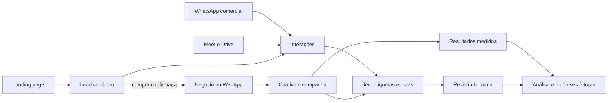

# Centralização dos dados da V2G

Mapa de 06/10/2026. Objetivo: reunir evidências comerciais e operacionais para que a V2G consiga explicar o que aconteceu com cada lead, cliente, criativo e campanha. Este documento é desenho e auditoria de leitura; não aplica migração nem importa dados.

## Decisão recomendada

Usar o **projeto Supabase V2G-SITE já compartilhado pelo WebApp e backend** como registro central. No Postgres, guardar identidades, vínculos, eventos, transcrições autorizadas e resultados estruturados. Guardar arquivos pesados em Storage privado ou preservar o original restrito no Google Drive, com referência e integridade no banco. Criar uma tela interna enxuta de leads/interações no WebApp quando o contrato estiver pronto. Um CRM contratado pode ser adicionado depois, como interface ou canal de entrada, sem virar uma segunda fonte de verdade.

**Duas populações devem ficar separadas:** contatos que compram a V2G e contatos que chegam aos clientes por anúncios. O primeiro é o funil comercial da V2G. O segundo exige acesso autorizado à operação do cliente e hoje pode aparecer apenas como contagem agregada; conversa recebida não demonstra venda. Esta distinção também reduz coleta desnecessária de dados pessoais.

## O que foi verificado

| Fonte | Evidência atual | Limite |
|---|---|---|
| LP | `lp/api/pre-cadastro.js:81-90` chama `inserir_lead_lp` no Supabase configurado por `SUPABASE_URL`. A tabela `public.leads_lp` existe em V2G-SITE e tinha **0 linhas** na consulta somente leitura de 06/10. | O valor da variável da Vercel não foi lido; não foi comprovado que o deploy atual aponta para este mesmo projeto nem que algum formulário válido foi enviado. O texto sem JS ainda promete 3 dias úteis em `api/pre-cadastro.js:24-25`, enquanto Victor decidiu 30 minutos. |
| WebApp | `businesses` guarda dados e respostas de onboarding. | `leads_lp` não tem vínculo persistido com `businesses`; a passagem de lead a cliente precisa de ID estável e regra de deduplicação. |
| Reuniões | `public.entrevistas` já existe, contém **1 linha** e se vincula a `businesses.id`. A transcrição pode ser nula (`0025_entrevista_sem_transcricao.sql:22-26`). | Não serve, como está, para reunião comercial com prospect ainda sem `business_id`. A migration registra que não havia porta de escrita do WebApp (`0025_entrevista_sem_transcricao.sql:14-18`). A tabela declara guarda de texto e não de áudio. |
| Resultados | `metricas_diarias` continha **3 linhas** e `respostas_do_dono`, **3**. Há ligação por execução/dia; `creatives` possui `external_ad_id`. | `metricas_diarias` agrega por campanha e dia. Sem resultado por anúncio/criativo e desfecho comercial confiável, não se pode atribuir venda a uma peça. |
| Arquivos | O projeto tem bucket privado `v2g-midia`. | Não foi verificado como arquivos comerciais seriam segregados e quem poderia lê-los; evitar misturá-los à mídia do cliente sem uma política explícita. |

Contagens são um retrato da consulta ao projeto V2G-SITE em 06/10/2026, não uma verificação de todos os arquivos existentes no Google Workspace ou em computadores pessoais.

## Modelo mínimo a construir

1. **Lead/oportunidade:** ID próprio, origem (`leads_lp` ou importação), contato normalizado, negócio declarado, estágio comercial, responsável e desfecho. Uma compra aprovada liga esse ID a `businesses.id`; não reescreve o registro original da LP.
2. **Interação:** uma linha para cada conversa ou reunião, com `lead_id` ou `business_id`, canal, início/fim, participantes necessários, status da transcrição, local do original e quem registrou. A ligação precisa aceitar prospect antes da compra.
3. **Fonte/evidência:** tipo, identificador na origem (Meet/Drive/WhatsApp/LP), URL ou caminho privado, data de captura, hash quando aplicável, finalidade, acesso e prazo de retenção. Importação repetida do mesmo identificador não cria duplicata.
4. **Fatos derivados:** campos extraídos, rótulos do Jev, modelo e versão da pergunta, probabilidade/confiança quando houver, trecho de origem, correção do gestor. Dado relatado, medido, inferido e ausente são estados distintos.
5. **Resultado:** preservar os contratos atuais de campanha e resposta do dono; quando houver dado autorizado no nível de anúncio, ligar `external_ad_id` ao criativo e à janela de resultado. Definir o que é contato, venda confirmada e receita antes de treinar previsão.

Dados pessoais e transcrições exigem acesso restrito por função e negócio. O [Supabase recomenda RLS para tabelas expostas](https://supabase.com/docs/guides/database/postgres/row-level-security) e [buckets privados com políticas de acesso](https://supabase.com/docs/guides/storage/buckets/fundamentals). Este modelo ainda precisa de revisão das políticas e dos períodos de retenção antes de receber material real em massa.

## Captura prática

**Agora, sem integração nova:** separar uma amostra pequena de reuniões e conversas comerciais que tenham finalidade e acesso claros. Manter os originais na origem restrita, registrar um índice com data, canal, pessoa/negócio, localização do arquivo e desfecho conhecido, e preservar o texto exato. Não importar o histórico inteiro antes de testar duplicação, permissões e vínculo com o lead.

**Meet futuro:** ativar transcrição nas reuniões adequadas, registrar evento e ID do Meet, obter transcrição e vincular ao lead. A [API do Meet recupera gravações, transcrições e entradas](https://developers.google.com/workspace/meet/api/guides/artifacts); a produção de artefatos precisa ser configurada e o arquivo fica no Drive do organizador. As entradas estruturadas da API expiram após 30 dias, portanto a importação automática deve ser pontual. Preservar só a transcrição no banco corresponde ao desenho atual de `entrevistas`; guardar áudio seria uma nova decisão de produto e retenção.

**WhatsApp comercial:** começar com importação manual de conversas selecionadas e vinculadas ao lead. A captura automática futura depende do canal usado pela V2G e das permissões correspondentes; não assumir que o histórico de uma conta pessoal pode ser sincronizado por API.

**LP:** confirmar o projeto apontado por `SUPABASE_URL` na Vercel sem revelar a chave, validar com um envio de teste autorizado e conferir a linha criada. Corrigir o texto de confirmação dos 3 dias para o prazo atual de 30 minutos em bloco próprio da LP.

## Primeira entrega de implementação

Construir a **espinha comercial e de evidências**: contrato de lead canônico, interação, origem e ligação a `businesses`; uma tela interna simples para registrar/importar reunião e desfecho; migração local revisável e política de acesso. Não criar cobrança, campanha ou disparo de mensagem nessa entrega. Em paralelo, auditar o vínculo `businesses` → `execucoes` → criativo → métricas para definir o que falta para medir peça individual.

Critérios de aceite: (a) um lead da LP ou importado tem ID único; (b) duas interações preservam data e fonte; (c) a venda vincula o lead ao negócio sem apagar histórico; (d) a mesma fonte importada duas vezes não duplica; (e) acesso de outro cliente é negado; (f) reunião sem transcrição aparece como pendente, não como vazia; (g) nenhuma resposta do Jev substitui a fonte ou a correção humana. O teste usa dados fictícios; dados reais só depois de conferir o contrato e as permissões.

## Pontos que exigem decisão dos fundadores

- Quem pode ler transcrição comercial: Victor, Gabriel e quais gestores?
- A V2G quer preservar gravações além do Drive do organizador ou somente transcrições e metadados?
- Qual período de retenção para conversas de interessados que não compraram e para reuniões de clientes?
- Em qual WhatsApp estão as conversas comerciais hoje: número pessoal, WhatsApp Business App ou plataforma/API?

Essas decisões não impedem inventário e desenho do contrato. Impedem apenas a importação indiscriminada do histórico e uma política de acesso final.
