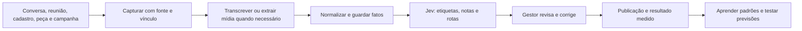

# Dados primeiro com Jev na V2G

Atualização de direção dada por Victor em 06/10/2026. A V2G está antes do uso amplo do produto por clientes, e o tempo do gestor em cada atividade não foi medido. A prioridade é criar uma base confiável de fatos da operação. Jev entra como ferramenta para classificar e pontuar esses fatos em volume, quando a tarefa tiver respostas delimitadas.

## O ciclo que precisamos construir

Cada registro derivado deve apontar para a fonte e para o cliente, campanha ou criativo correspondente. Uma etiqueta do Jev deve guardar pergunta e versão, resposta, confiança/probabilidade disponível, data, modelo e correção humana. O resultado deve registrar fonte, período, objetivo e se foi medido. Uma ausência de dado não vira zero. O acesso aos originais e sua retenção precisam seguir a autorização e a finalidade de cada fonte.

| Fonte | O que vale extrair agora | Estado verificado neste WebApp |
|---|---|---|
| Conversa comercial | Motivo do contato, objeções, promessa feita, desfecho e por que fechou ou não | Não foi localizada nesta revisão uma captura estruturada de conversas comerciais; LP/CRM ficam fora deste checkout. |
| Reunião e onboarding | Respostas, necessidades, acesso pendente, oferta e primeiro criativo escolhido | Respostas do bloco inicial são salvas em `businesses.onboarding` por `app/(fluxo)/onboarding/actions.ts`. `lib/agentes/extrair-perfil.ts` recebe transcrição e propõe campos, mas não comprova captura de Meet. |
| Criativo próprio | Arquivo, briefing, versão, tags, revisão, publicação e vínculo com campanha | `docs/estado/criativos-fila-06-10.md` registra que o envio analisado ainda não gera submissão durável e pendência ao gestor. |
| Campanha e resultado | Conta, campanha, peça, gasto, objetivo, contatos medidos e venda confirmada | `lib/resultado/do-negocio.ts` consulta consolidados do backend; `lib/resultado/ler.ts` distingue contatos medidos de ausentes e vendas informadas. Atualidade, cobertura e atribuição ainda precisam de auditoria. |
| Biblioteca pública de anúncios | Página, peça, texto, formato, datas e tags semânticas | Não foi localizada integração de coleta neste WebApp. Para anúncios comerciais comuns no Brasil, a biblioteca pública não fornece vendas ou retorno. |

## Onde Jev gera valor

1. **Indexar conversas e reuniões:** Choice para assunto, objeção, estágio e próximo responsável; Noul para sinais explícitos; Score para clareza de briefing. Transcrição e extração de campos abertos são etapas separadas.
2. **Indexar criativos próprios e referências públicas:** após OCR/visão ou metadados, Choice para gancho, formato, oferta e etapa da jornada; Score para aderência a um briefing. O gestor escolhe o criativo a testar.
3. **Comparar semelhantes:** recuperar candidatos por nicho, oferta, região e perfil; Jev pontua aderência entre briefing e peça. Dados de bairro/renda precisam vir de fonte explícita, não de suposição do modelo.
4. **Roteamento de agentes:** Jev escolhe regra, modelo generativo, ferramenta ou revisão humana a partir de opções autorizadas. Medir o custo e a qualidade do caminho inteiro.
5. **Base para previsão futura:** relacionar etiquetas com resultados próprios medidos e desfechos de venda. Só depois testar previsão temporal fora da amostra. Previsão e recomendação precisam ser avaliadas por nicho e com volume suficiente.

O [post de Stav Zilbershtein](https://x.com/mightyking/status/2100939189869002819) relata 1.891 anúncios classificados por etapa da jornada e estilo em 19 segundos por US$ 0,12. O [catálogo jevai.dev](https://jevai.dev/pt/user-cases/) descreve isso como protótipo e separa a classificação da análise mais ampla da conta. Esses números não foram medidos pela V2G. A [API da Biblioteca de Anúncios da Meta](https://pt-br.facebook.com/ads/library/api) lista conteúdo, página, datas e posições; alcance, impressão e gasto têm disponibilidade restrita por tipo de anúncio e região. Para anúncios comerciais comuns no Brasil, a Biblioteca não revela conversões, faturamento ou o perfil exato do comprador.

Assim, no exemplo da pizzaria, Jev pode encontrar anúncios de outras pizzarias com oferta e estilo parecidos, etiquetá-los e comparar com um briefing. Chamar uma peça de “funciona muito” exige dados de resultado da própria conta do anunciante ou teste da V2G em conta autorizada. Duração de veiculação pode ser um sinal de interesse, não prova de retorno.

## Primeira entrega de dados

Mapear fontes e identificadores existentes antes de integrar uma nova fonte. Escolher um único percurso rastreável: **resposta de onboarding → briefing → criativo escolhido → publicação manual → resultado medido → correção do gestor**. Especificar os eventos, vínculos, origem e estados de ausência; verificar no WebApp e no backend onde cada dado nasce e persiste. Em paralelo, preparar uma pequena coleção de exemplos desidentificados e rotulados por gestor para medir classificações Jev. Só conectar conversas comerciais, Meet e biblioteca quando fonte, acesso, formato e retenção estiverem definidos.

Critério de sucesso da primeira entrega: conseguir reconstruir, para um cliente de teste, a origem de cada informação e o vínculo entre criativo, campanha e resultado, distinguindo dado medido, relato do cliente, inferência e ausência. Não depende de uma previsão pronta nem de uma economia presumida de tempo.
